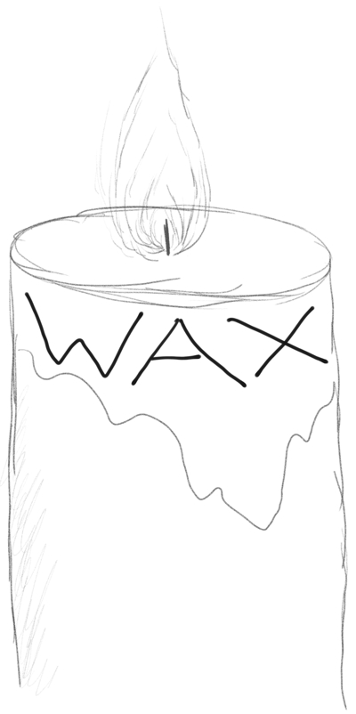

# The 2018 Workshop on Approximate Computing Across the Stack

Welcome to the 2018 Workshop on Approximate Computing Across the Stack (WAX)! WAX is a venue for research focusing on computing with unreliability and inexactness.
It was co-located with [ASPLOS 2018][].

The WAX 2018 [keynote][] was by [Phillip Stanley-Marbell](http://www.phillipstanleymarbell.org) from the University of Cambridge.
There were [nine thought-provoking position papers][program] presented at the workshop.

You can see the archived [call for participation][cfp] or the [program][].

[hotcrp]: http://www.cs.cornell.edu/conferences/wax2018/
[hank-email]: mailto:hankhoffmann@cs.uchicago.edu
[topics]: https://github.com/cucapra/wax2018/wiki/Discussion-Topics
[program]: program.html
[keynote]: keynote.html

Previous instances:

* [WAX 2017][], at ASPLOS
* [WAX 2016][], at ASPLOS
* [WAX 2015][], at FCRC
* [WACAS 2014][], at ASPLOS
* [APPROX 2014][], at PLDI

[wax 2017]: http://approximate.computer/wax2017/
[wax 2016]: http://approximate.computer/wax2016/
[asplos 2018]: https://www.asplos2018.org
[wax 2015]: http://sampa.cs.washington.edu/new/wax2015/
[wacas 2014]: http://sampa.cs.washington.edu/new/wacas14/
[approx 2014]: http://approx2014.cs.umass.edu/
[cfp]: http://approximate.computer/wax2018/cfp.html
